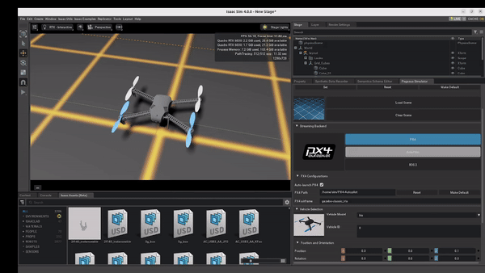

# PegasusArduPilot


[)](https://discord.gg/AjCxw2QUmt)

**PegasusArduPilot** is a fork of the [PegasusSimulator](https://github.com/PegasusSimulator/PegasusSimulator) project, built on top of [NVIDIA
Omniverse](https://docs.omniverse.nvidia.com/) and [IsaacSim](https://docs.omniverse.nvidia.com/app_isaacsim/app_isaacsim/overview.html).

This project bridges between the ArduPilot project and IsaacSim, allowing the ArduPilot community to leverage IsaacSim's physics simulation and photorealistic rendering capabilities!

> **Notice:** A pull request of the features included in this fork was submitted into the [PegasusSimulator](https://github.com/PegasusSimulator/PegasusSimulator), and hopefully intended to be merged into the main project.


<p align = "center">

  

  

  
  
  
</p>

## Setup
1. Follow PegasusSimulator installation steps: https://pegasussimulator.github.io/PegasusSimulator/source/setup/installation.html
2. Follow ArduPilot SITL installation steps:
  - https://ardupilot.org/dev/docs/building-setup-linux.html#building-setup-linux
  - https://ardupilot.org/dev/docs/setting-up-sitl-on-linux.html#setting-up-sitl-on-linux
  
  You may install ArduPilot at `~/ardupilot`, or change the path in the UI inside Pegasus backend selection menu.

## [PyArduPilotPlugin](https://github.com/TomerTip/PyArduPilotPlugin)
To get PegasusSimulator and ArduPilot SITL talking, I created a Python implementation of the custom protocol used between ArduPilot SITL and the simulator - called [PyArduPilotPlugin](https://github.com/TomerTip/PyArduPilotPlugin).
This project allows developers to create a custom simulator and integrate it with ArduPilot SITL control using Python!

## Changes to main Project
Since the code of PegasusSimulator is currently tightly coupled with `PX4`, I had to change the backend class hierarchy to become more generic and extendable. 
<p align = "center">
  
</p>


## Citation

If you find PegasusArduPilot Simulator useful in your academic work, please cite the paper below. It is also available [here](https://doi.org/10.1109/ICUAS60882.2024.10556959).
```
@INPROCEEDINGS{10556959,
  author={Jacinto, Marcelo and Pinto, João and Patrikar, Jay and Keller, John and Cunha, Rita and Scherer, Sebastian and Pascoal, António},
  booktitle={2024 International Conference on Unmanned Aircraft Systems (ICUAS)}, 
  title={Pegasus Simulator: An Isaac Sim Framework for Multiple Aerial Vehicles Simulation}, 
  year={2024},
  volume={},
  number={},
  pages={917-922},
  keywords={Simulation;Robot sensing systems;Real-time systems;Sensor systems;Sensors;Task analysis},
  doi={10.1109/ICUAS60882.2024.10556959}}
```

## Licenses

PegasusSimulator is released under [BSD-3 License](LICENSE). The license files of its dependencies and assets are present in the [`docs/licenses`](docs/licenses) directory.

NVIDIA Isaac Sim is available freely under [individual license](https://www.nvidia.com/en-us/omniverse/download/). 

ArduPilot is available as an open-source project under [GPL-3 License](https://github.com/ArduPilot/ardupilot).
